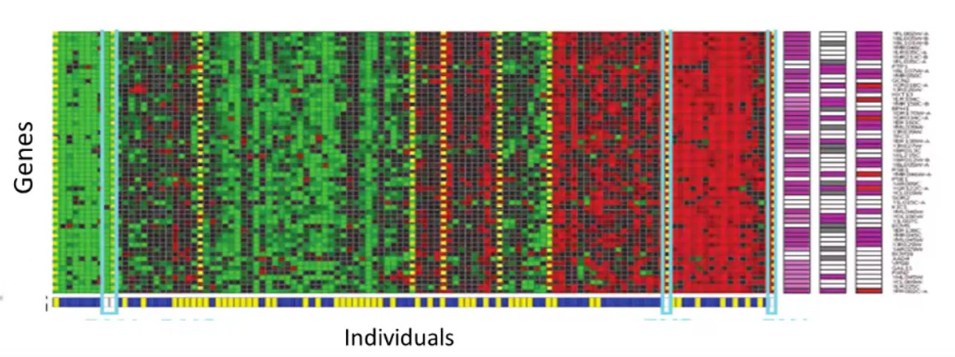
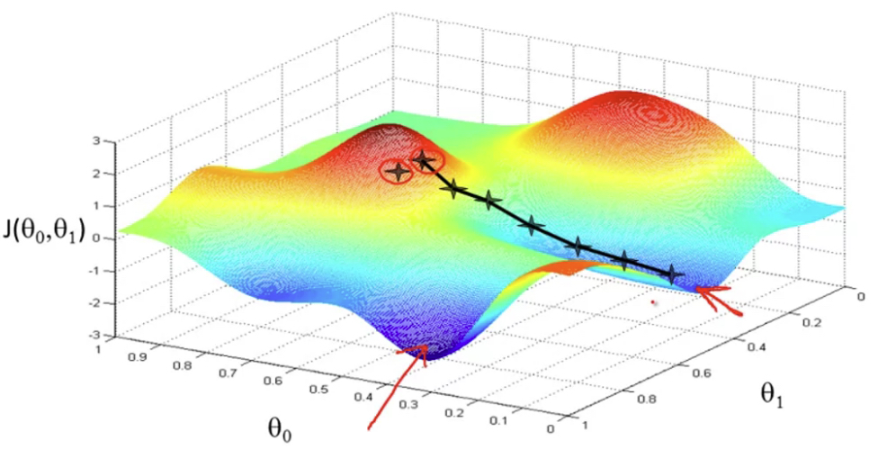
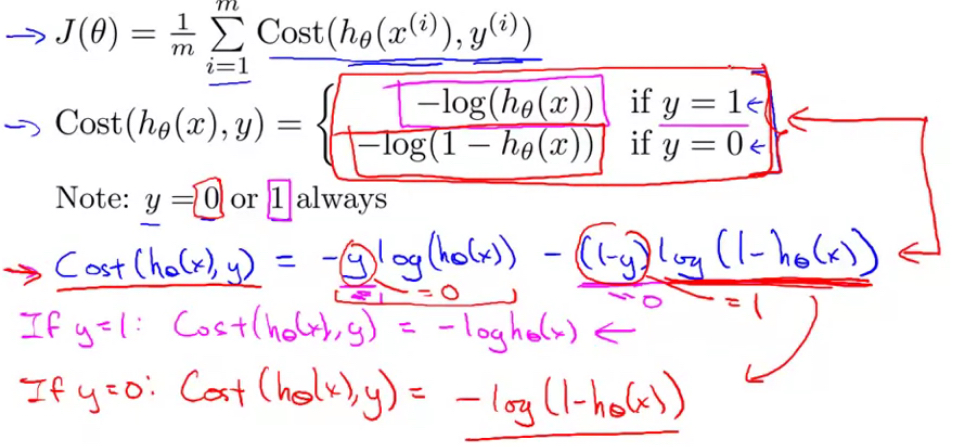

# machine_learning-andrew_ng

This is the [coursera course](https://www.coursera.org/learn/machine-learning-course) from Andrew Ng

# 1. Environment Setup

<br><br><br>

```bash
# 1. setup local environment
$ pyenv local 3.10.8
# $ pyenv local 3.8.15

# 2. setup virtual environment
$ python3.10 -m venv .venv
# $ python3.8 -m venv .venv

# 3. set intepreter
>> CMD + Shift + P ==> Interpreter ==> ./.venv/bin/python

# 4. check current python3 version
$ python3 --version
$ python3 -m pip --version
$ pip install --upgrade pip

# 5. activate virtual envrionment
$ source ./.venv/bin/activate

# 6. tensorflow installation
$ python3 -m pip install --default-timeout=10000 tensorflow-macos


$ pip install --upgrade pip
```

select current virutal environment

```bash
# downgrade python version
# 1. check all python versions
$ pyenv install --list

# 2. install 3.8.15
$ pyenv install 3.8.15

# 3. check all version
$ pyenv versions

# 4. remove .venv folder

# 5. repeat virual env setup steps

```

<br><br><br>

## 1.2 Tips

### 1.2.1 references

[numpy_docs](https://numpy.org/doc/stable/index.html)

<br><br><br>

# Week-1

## 1.1 Introduction

### 1.1.1 Intro

- Machine Learning
  - Grew out of work in AI
  - New capability for computers
- Exmaples:
  - Database mining
    - Large datasets from growth of automation/web
    - E.g. Web click data, medical records, biology, engineering
  - Applications can't program by hand
    - E.g. Autonomous helicopter, handwriting recognition, most of NLP, Computer Vision
  - Self-customizing programs
    - E.g. Amazon, Netflix product recommendations
  - Understanding human learning(brain, real AI)

<br><br><br>

### 1.1.2 What is Machine Learning?

- Machine Learning Definition

  - Arthur Samuel(1959). Machine Learning: Field of study that gives computers the ability to learn without being explicitly programmed
  - Tom Mitchell(1998) well-posed learning problem: A computer program is said to learn from experience E with respect to some task T and some performance measure P, if its performance on T, as measured by P, improved with experience E.
    - Sample-1
      - `E` the exprience of playing many games of checkers
      - `T` the taks of playing checkers
      - `P` the prob that the program will win the next game
    - Sample-2
      - `E` Watching u label emails as spam or not spam
      - `T` Classifying emails as spam or not spam
      - `P` The number (or fraction) of emails correctly classified as spam/ not spam

- Machine learning algorithms:

  - Supervised learning
  - Unsupervised learning
  - others: Reinforcment learning, recommender systems

- Practical advice for applying learning algorithms

<br><br><br>

### 1.1.3 Supervised Learning

- We are given a data set and already know what our correct output should look like, having the idea that there is a relationship between the input and output
- `Regression`: we are trying to predict results within a continuous output, meaning that we are trying to map inut variables to some continous function

- `Classification`: we are trying to predict results in a discrete output. In other words, we are trying to map input variables into discrete categories

- Example 1:

  - Given data about size of houses on the real estate market, try to predict their price. Price as a function of size is a continuous output, this is a regression problem
  - By making our output as `whether the house sells for more or less than the asking price`, we turn it into a classification problem

- Example 2:

  - House price prediction

    - Supervised learning: "right answers" given
    - Regression: Predict continuous valued output (price)
    - <br><br><br><br><br><br>

  - Breast cancer(malignant, benign)

    - Classification: discrete valued output(0 or 1)
    - <br><br><br><br><br><br>

  - Breast cancer another approach
    - Deal with infinite features (SVM - supported vector machine)
    - Clump thickness, Uniformity of Cell Size, Uniformity of Cell Shape
    - <br><br><br><br><br><br>

<br><br><br>

### 1.1.4 Unsupervised Learning

- Unsupervised Learning

  - We can derive structure from data where we don't neccessarily know the effect of the variables
  - we can derive this structure by clustering the data based on relationships among the variables in the data.
    - <br><br><br><br><br><br>

- Example:
  - clustering: take a collection of 1,000,000 different genes, and find a way to automatically group these genes into groups that are somehow similar or related by different variables, such as lifespan, location, roles and so on
    - <br><br><br><br><br><br>
    - <br><br><br><br><br><br>
  - non-clustering: the "cocktail party algorithm", allows u to find structure in a chaotic environment (i.e. identityfing individual voices and music from a mesh of sounds at a cocktail party)
    - `[W,s,v] = svd((repmat(sum(x.*x, 1), size(x, 1), 1).*x)*x')`;
      - svd - singular value decomposition

<br><br><br>

## 1.2 Model and Cost Function

### 1.2.1 Model Representation

- x<sup>(i)</sup> denotes input
- y<sup>(i)</sup> denotes output
- (x<sup>(i)</sup>, y<sup>(i)</sup>); i = 1, ...,m - is called a training set
- to learn a function `h: X -> Y` so that h(x) i a "good" predictore for the corresponding value of y. this function called `hypothesis`

- Example
  - Housing Prices (Portland, OR)
    - supervised learning: given the "right answer" for each example in the data
    - Regression problem: predicted real-valued output
      - <br><br><br><br><br><br>
      - <br><br><br><br><br><br>
      - <br><br><br><br><br><br>

### 1.2.2 Cost Function

- we can measure the accuracy of our hypothesis by using a `cost function`. this takes an average difference of all results of the hypothesis with inputs from x's and the actual ouput y's

  - <br><br><br>
  - 1/2\*x where x is the mean of squares of h<sub>θ</sub>(x<sub>i</sub>) - y<sub>i</sub>, or the difference between `the predicted value and actual value` <br><br><br>

- this function is otherwise called the `Squared Error Function` or `Mean squared error`. The mean is halved (1/2) as a convenience for the computation of the gradient descent, ad the derivative term of the square function will cancel out the 1/2 term

  - <br><br><br><br><br><br>
  - <br><br><br><br><br><br>
  - <br><br><br><br><br><br>

### 1.2.3 Cost Function Intuition I

- Our training data set is scattered on the x-y plane. We are trying to make a straight line pass through all these scattered data points. The best possible line will be such so that the average squared vertical distances of the scattered points from the line will be the least. In such case, the value of J(θ<sub>0</sub>, θ<sub>1</sub>) will be 0

  - <br><br><br><br><br><br>

- when θ<sub>1</sub> = 1, we get a slope of 1 which goes through all single data in our model
- when θ<sub>1</sub> = 0.5, we see the vertical distance from out fit to the data points increase
  - <br><br><br><br><br><br>
- we should try to minimize the cost function, in this case, θ<sub>1</sub> = 1 is our global minimum
  - <br><br><br><br><br><br>

### 1.2.4 Cost Function Intuition II

- a contour line of two variable function has a constant value at all points of the same line
- The three green points below have the same value of J(θ<sub>0</sub>, θ<sub>1</sub>), the are found along the same line.

  - <br><br><br><br><br><br>

- when θ<sub>0</sub> = 360 and θ<sub>1</sub> = 0, the value of J(θ<sub>0</sub>, θ<sub>1</sub>) contour plot gets closer to the center thus reducing the cost function error
  - <br><br><br><br><br><br>
- the graph below minimizes the cost function as much as possible and consequently, the result of θ<sub>0</sub> and θ<sub>1</sub> tend to be around 0.12 and 250 respectively. Plotting those values on our graph seems to put our point in the center of the inner most `circle`

## 1.3 Parameter Learning

### 1.3.1 Gradient Descent

- we need to estimate the parameters in the hypothesis function. that's where `gradient descent` comes in. we put θ<sub>0</sub> on x axis and θ<sub>1</sub> on y axis, with the cost function on the vertical z axis.
- <br><br><br><br><br><br>

  - if choose a different start point
    - <br><br><br><br><br><br>

- the way we do this is by taking the derivative of our cost function. the slope of the tangent is the derivative at that point and it will give us a direction to move towards. - we make steps down the cost fucntion in the direction with the steepest descent - the size of each step is determined by the parameter `𝛂`, called learning rate

  - A smaller `𝛂` result in a smaller step
  - A larger `𝛂` result in a larger step
  - the direction in which the step is taken is determined by the partial derivative of J(θ<sub>0</sub>, θ<sub>1</sub>).
  - Depending on where on starts on the graph

- repeat until convergence:

  - j = 0,1 represents the feature index number
  - `:=` assignment operator
  - <br><br><br><br><br><br>

- at each iteration j, one should simultaneously update the parameters θ<sub>1</sub>, θ<sub>2</sub>, ..., θ<sub>n</sub>. `Updating a specific parameter prior to calculating another one on the` j<sup>th</sup> `iteration would yield to a wrong implemention`

  - <br><br><br><br><br><br>

<br><br><br>

### 1.3.2 Gradient Descent Intuition

- <br><br><br><br><br><br>

- <br><br><br><br><br><br>

- if θ<sub>1</sub> stays in local minimal, then it stays unchanged as slope is 0

  - <br><br><br><br><br><br>

- Gradient descent can converge to local minimum, even with the learning rate `𝛂` fixed. As we approach a local minimum, gradient descent will automatically take smaller steps (slope to be 0 to the local minimum, so the slope is getting smaller). So no need to decrease `𝛂` over time
  - <br><br><br><br><br><br>

<br><br><br>

### 1.3.3 Gradient Descent for linear regression

- Substitute our actual cost function and our actual hypothesis and modify equation to

  - m - size of the traning set
  - θ<sub>0</sub> - the constant
  - θ<sub>1</sub> - the constant, changing simultaneously with θ<sub>1</sub>
  - x<sub>i</sub>, y<sub>i</sub> are values of the given training set(data)
  - <br><br><br><br><br><br>

- Derivative

  - <br><br><br><br><br><br>

- The point of all this is that if we start with a guess for our hypothesis and then repeatedly apply these gradient descent equations, our hypothesis will become more and more accurate.

- `Batch Gradient Descent` (scale better in large dataset)

  - Each step of gradient descent uses all the training example
  - bowl shape - convex function
    - no local minimal but one global minimal
  - <br><br><br><br><br><br>

- normal equation method

<br><br><br><br><br><br>

## 1.4 Linear Algrebra Review

<br><br><br>

### 1.4.1 Matrices and Vectors

- A<sub>ij</sub> = "i,j entry" in the i<sup>th</sup> row, j<sup>th</sup> column
- uppercase for matrix, lowercase for vector
- A vector with 'n' rows is referred to as an 'n'-dimensional vector.
- v<sub>j</sub> refers to the element in the ith row of the vector
- all our vectors and matrices will be 1-indexed. Note that for some programming languages, the arrays are 0-indexed.
- "Scalar" means that an object is a single value, not a vector or matrix.
- ℝ refers to the set of scalar real numbers.
- ℝ<sup>n</sup> refers to the set of n-dimensional vectors of real numbers

```py
% The ; denotes we are going back to a new row.
A = [1, 2, 3; 4, 5, 6; 7, 8, 9; 10, 11, 12]

% Initialize a vector
v = [1;2;3]

% Get the dimension of the matrix A where m = rows and n = columns
[m,n] = size(A)

% You could also store it this way
dim_A = size(A)

% Get the dimension of the vector v
dim_v = size(v)

% Now let's index into the 2nd row 3rd column of matrix A
A_23 = A(2,3)

```

<br><br><br>

### 1.4.2 Addition and Scalar mutiplication

- Addition and subtraction are element-wise
- In scalar multiplication, we simply multiply every element by the scalar value
- In scalar division, we simply divide every element by the scalar value

<br><br><br>

### 1.4.3 Matrix vector multiplication

- The result is a vector. The number of columns of the matrix must equal the number of rows of the vector.
- An m x n matrix multiplied by an n x 1 vector results in an m x 1 vector.

<br><br><br>

### 1.4.4 Matrix matrix multiplication

- <br><br><br><br><br><br>

- prediction of first h<sub>θ</sub>

  - <br><br><br><br><br><br>

- An m x n matrix multiplied by an n x o matrix results in an m x o matrix. In the above example, a 3 x 2 matrix times a 2 x 2 matrix resulted in a 3 x 2 matrix.

<br><br><br>

### 1.4.5 Matrix multiplication properties

- Commutative

  - reverse the order of matrices muliplication, it even result in different dimensions
  - <br><br><br><br><br><br>

- Associative

  - <br><br><br><br><br><br>

- `Identity Matrix`
  - <br><br><br><br><br><br>

<br><br><br>

### 1.4.6 inverse and transpose

- Matrix inverse

  - [calculate inverse of matrix manually](https://www.youtube.com/watch?v=Fg7_mv3izR0)
  - <br><br><br><br><br><br>

- Matrix transpose
  - <br><br><br><br><br><br>

<br><br><br><br><br><br>

# Week-2

<br><br><br>

## 2.1 Environment setup instructions

<br><br><br>

## 2.2 Multivariate Linear Regression

<br><br><br>

### 2.2.1 Multiple Features

- Notation:

  - n = the number of features
  - m = the number of training examples
  - x<sup>(i)</sup> = input (features) of i<sup>th</sup> training example
  - x<sup>(i)</sup><sub>j</sub> = value of feature j in i<sup>th</sup> training example

  - <br><br><br><br><br><br>

- hypothesis
  - The multivariable form of the hypothesis function accommodating these multiple features is as follows:
    - <br><br><br>
  - 0 feature x<sup>(i)</sup><sub>0</sub> = 1
  - we can think about θ<sub>0</sub> as the basic price of a house, θ<sub>1</sub> as the price per square meter, θ<sub>2</sub> as the price per floor, etc. x<sub>1</sub> will be the number of square meters in the house, x<sub>2</sub> the number of floors, etc.
  - <br><br><br><br><br><br>

<br><br><br>

### 2.2.2 Gradient Descent for multiple variables

- Basic theory

  - <br><br><br><br><br><br>

- Gradient Descent

  - the gradient descent equation itself is generally the same form; we just have to repeat it for our 'n' features
  - <br><br><br>

  - repeat until convergence:
  - <br><br><br><br><br><br>

<br><br><br>

### 2.2.3 Gradient Descent in Practice I - Feature Scaling

- We can speed up gradient descent by having each of our input values in roughly the same range.

- `Feature Scaling`
  - Idea **make sure features are on a similar scale**.
    - or gradient descent will take a long time to converge
    - <br><br><br><br><br><br>
  - get every feature into approximately a -1 <= x<sub>i</sub> <= 1 range
    - <br><br><br><br><br><br>
- `Mean normalization`
  - Replace x<sub>i</sub> with x<sub>i</sub> - 𝜇<sub>i</sub> to make features have approximately zero mean (do not apply to x<sub>0</sub> = 1)
  - 𝜇<sub>i</sub> - `average` of all the values for feature (i)
  - s<sub>i</sub> - range of (max_value - min_value), the standard deviation
  - <br><br><br><br><br><br>

<br><br><br>

### 2.2.4 Gradient Descent in Practice II - Learning Rate

- Gradient descent

  - **Debugging gradient descent**: how to make sure gradient descent is working correctly
    J(θ) should decrease after every iteration

    - <br><br><br><br><br><br>

  - **Automatic convergence test**: eclare convergence if J(θ) decreases by less than E in one iteration, where E is some small value such as 10<sup>−3</sup>. However in practice it's difficult to choose this threshold value

  - how to choose learning rate `𝛼`
    - <br><br><br><br><br><br>
    - if graph as below, the cost function is increasing, you probably need use a smaller learning rate `𝛼`
    - for sufficiently small `𝛼`, J(θ) should decrease on every iteration
    - but if `𝛼` is too small, gradient descent can be slow to converge
      - <br><br><br><br><br><br>

- Summary
  - if `𝛼` is too small: slow convergence
  - if `𝛼` is too large: J(θ) may not decrease on every iteration; may not converge
  - to chooes `𝛼`, try (3x than previous)
    - .... -.001, 0.003, 0.01, 0.03, 0.1, 0.3, 1, ...

<br><br><br>

### 2.2.5 Features and Polynomial Regression

- Housing prices prediction

  - h<sub></sub>(x) = θ<sub>0</sub> + θ<sub>1</sub> x _frontage_ + θ<sub>2</sub> x _depth_
    - <br><br><br><br><br><br>

- Choice of features

## 2.3 Computing Parameters Analytically

<br><br><br>

### 2.3.1 Normal Equation

- Intuition

  - how to minimize a quadratic function?
  - <br><br><br><br><br><br>

- Equation

  - <br><br><br><br><br><br>

- example

  - <br><br><br><br><br><br>

- 𝜃 = (X<sup>T</sup> X)<sup>-1</sup> X<sup>T</sup> y

  - <br><br><br><br><br><br>

- when `gradient descent`, when `normal equation`
  - <br><br><br><br><br><br>

<br><br><br>

### 2.3.2 Normal Equation Noninvertibility

- Normal equation

  - <br><br><br><br><br><br>

- what if is X<sup>T</sup>X non-invertible `Rarely`
  - Redundant features (linearly dependent) `Delete redundant feature`
    - e.g. x1 = size in feet<sup>2</sup>
    - x2 = size in m<sup>2</sup>
  - Too many features (e.g. m <= n)
    - Delete some features, or use regularization

<br><br><br>

## 2.4 Submitting Programming Assignments

### 2.4.1 Working on and submitting programming assignments (using python package - numpy)

<br><br><br><br><br><br>

## 2.5 Python/ Octave/ Matlab tutorial

### 2.5.7 Vectorization

- <br><br><br><br><br><br>
- <br><br><br><br><br><br>
- <br><br><br><br><br><br>
- <br><br><br><br><br><br>

<br><br><br><br><br><br>

# Week-3

## 3.1 Classification and Representation

### 3.1.1 Logistic regression - Classification

1. classification
   - we will focus on the **binary classification problem** in which y can take on only two values, 0 and 1.
   - <br><br><br><br><br><br>
   - <br><br><br><br><br><br>
   - <br><br><br><br><br><br>

### 3.1.2 Logistic regression - Hypothesis representation

1. Logistic Regression Model
   - <br><br><br><br><br><br>
2. interpretation of Hypothesis output
   - probability that y = 1, given x, parameterized by θ
   - <br><br><br><br><br><br>

### 3.1.3 Logistic regression - Decision Boundary

1. Logistic regression

   - <br><br><br><br><br><br>
   - <br><br><br><br><br><br>

2. Decision Boundary

   - this line called decision boundary
   - <br><br><br><br><br><br>

3. Non-linear decision boundaries
   - <br><br><br><br><br><br>

<br><br><br><br><br><br>

## 3.2 Logistic Regression Model

### 3.2.1 Cost Function

1. Cost function

   - <br><br><br><br><br><br>
   - <br><br><br><br><br><br>

2. Logistic regression cost function
   - <br><br><br><br><br><br>
   - y = 1
     - If our correct answer 'y' is 0, then the cost function will be 0 if our hypothesis function also outputs 0. If our hypothesis approaches 1, then the cost function will approach infinity.
     - <br><br><br><br><br><br>
   - y = 0
     - If our correct answer 'y' is 1, then the cost function will be 0 if our hypothesis function outputs 1. If our hypothesis approaches 0, then the cost function will approach infinity.
     - <br><br><br><br><br><br>

### 3.2.2 Simplified cost function and gradient descent

1. logistic regression cost function

   - <br><br><br><br><br><br>
   - <br><br><br><br><br><br>
   - vectorized implementation
     - <br><br><br><br><br><br>

2. Gradient Descent
   - <br><br><br><br><br><br>
   - <br><br><br><br><br><br>

### 3.2.3 Advanced optimization

1. optimization

   - <br><br><br><br><br><br>
   - Conjugate gradient
   - [BFGS](https://en.wikipedia.org/wiki/Broyden%E2%80%93Fletcher%E2%80%93Goldfarb%E2%80%93Shanno_algorithm)
   - [L-BFGS](https://en.wikipedia.org/wiki/Limited-memory_BFGS)
     - <br><br><br><br><br><br>

2. example
   - <br><br><br><br><br><br>
   - <br><br><br><br><br><br>

<br><br><br><br><br><br>

## 3.3 Multiclass Classification

### 3.3.1 Multiclass classification: one-vs-all

1. Multiclass classification

   - <br><br><br><br><br><br>
   - <br><br><br><br><br><br>

2. one-vs-all (one-vs-rest)
   - <br><br><br><br><br><br>
   - <br><br><br><br><br><br>

<br><br><br><br><br><br>

## 3.4 Solving the problem of overfitting

### 3.4.1 The problem of overfitting

1. Linear regression

   - <br><br><br><br><br><br>

2. Logistic regression

   - <br><br><br><br><br><br>

3. Addressing overfitting

   - <br><br><br><br><br><br>

   - Options:
     1. Reduce number of features
        - Manually select which features to keep
        - model selection algorithm (later in course)
     2. Regularization
        - Keep all the features, but reduce magnitude/ values of parameters
        - Regularization works well when we have a lot of slightly useful features (Works well when we have a lot of features, each of which contributes a bit to predicting y.)

### 3.4.2 Cost function

1. Intuition
   - <br><br><br><br><br><br>
2. `Regularization`

   - <br><br><br><br><br><br>
   - <br><br><br><br><br><br>

3. if 𝞴 is too large (regularization parameter)
   - <br><br><br><br><br><br>

### 3.4.3 Regularized Linear Regression

1. Regularized linear regression
   - <br><br><br><br><br><br>
2. Gradient descent

   - <br><br><br><br><br><br>

3. Normal equation

   - <br><br><br><br><br><br>

4. Non-invertibility (optional/ advanced)

### 3.4.4 Regularized Logistic Regression

- Regularized Logistic Regression
  - <br><br><br><br><br><br>
- Gradient descent
  - <br><br><br><br><br><br>
- Advanced optimization
  - <br><br><br><br><br><br>

<br><br><br><br><br><br>

# Week-4

## 4.1 Motivations

### 4.1.1 Non-linear Hypotheses

1. Non-linear classification
   - <br><br><br><br><br><br>
2. Computer vision; car detection

   - <br><br><br><br><br><br>
   - <br><br><br><br><br><br>
   - <br><br><br><br><br><br>

   - features = (50 \* 50)<sup>2</sup> / 2

<br><br><br><br><br><br>

### 4.1.2 Neurons and the Brain

1. Neural Networks

   - Origins: Algorithms that try to mimic the brain
   - Was very widely used in 80s and early 90s; popularity diminished in late 90s
   - Recent resurgence: state-of-the-art technique for many applications

2. the 'one learning algorithm' hypothesis

   - Auditory cortex learns to see
   - <br><br><br><br><br><br>
   - somatosensory cortex learns to see
   - <br><br><br><br><br><br>
   - <br><br><br><br><br><br>

## 4.2 Neural Networks

## 4.2.1 Model Representation I

1. Neuron in the brain

   - <br><br><br><br><br><br>
   - <br><br><br><br><br><br>

2. Neuron model: logistic unit

   - <br><br><br><br><br><br>

3. Neural Network

   - <br><br><br><br><br><br>
   - <br><br><br><br><br><br>

   - **If network has s<sub>j</sub> units in layer j and s<sub>j+1</sub> units in layer j+1, then θ<sup>(j)</sup> will be of dimension s<sub>j+1</sub> X (s<sub>j</sub>+1)**
   - The +1 comes from the addition in θ<sup>(j)</sup> of the "bias nodes," x<sub>0</sub> and θ<sub>0</sub><sup>(j)</sup>. `In other words the output nodes will not include the bias nodes while the inputs will.`
   - Example: If layer 1 has 2 input nodes and layer 2 has 4 activation nodes. Dimension ofθ<sup>(1)</sup> is going to be 4x3 where s<sub>j</sub>=2 and s<sub>j+1</sub> =4, so s<sub>j+1</sub> x (s<sub>j</sub> + 1) = 4 x 3

## 4.2.2 Model Representation II

[link](https://www.coursera.org/learn/machine-learning-course/supplement/YlEVx/model-representation-ii)

1. Forward propagation: Vectorized implementation

   - <br><br><br><br><br><br>

2. Neural Network learning its own features

   - <br><br><br><br><br><br>

3. Other network architecture
   - <br><br><br><br><br><br>

## 4.3 Applications

### 4.3.1 Examples and Intuitions I

1. Non-linear claasification example: XOR/ XNOR

   - <br><br><br><br><br><br>

2. Simple example: AND

   - <br><br><br><br><br><br>

3. Example: OR function
   - <br><br><br><br><br><br>

### 4.3.2 Examples and Intuitions II

1. Negation

   - if and only if x1 = x2 = 0, h(x) = 1
   - <br><br><br><br><br><br>

2. Putting it together: x1 XNOR x2

   - <br><br><br><br><br><br>

3. Neural Network intuition

   - <br><br><br><br><br><br>

4. Handwritten digit classification
   - <br><br><br><br><br><br>

### 4.3.3 Multiclass Classification

1. multiple output units: one-vs-all

   - <br><br><br><br><br><br>
   - <br><br><br><br><br><br>

2. Question
   - `add one more bias unit`: `(5 + 1) x 10`
   - <br><br><br><br><br><br>

## 4.4 Review

<br><br><br><br><br><br>

# 5. Neural Network Learning

## 5.1 Cost Function and Backpropagation

### 5.1.1 Cost Function

1. Neural Network (classification)
   - <br><br><br><br><br><br>
2. Cost function
   - the doulbe sum simply adds up the logistic regression costs calculated for each cell in the ouput layer
   - the triple sum simply adds up the squares of all the individual Θs in the entire network
   - the i in the triple sum does not refer to training example i
   - <br><br><br><br><br><br>

### 5.1.2 Backpropagation Algorithm

- Backpropagation is neural-network terminology for minimizing our cost function.
- [doc_ref](https://www.coursera.org/learn/machine-learning-course/supplement/pjdBA/backpropagation-algorithm)

1. Gradient computation

   - <br><br><br><br><br><br>
   - <br><br><br><br><br><br>

2. Gradient computation: Backpropagation algorithm

   - inorder to compute derivative, use backpropagation
   - a<sup>(4)</sup><sub>j</sub> - activation of layer 4 node j unit
   - y<sub>j</sub> - j<sub>th</sub> element of vector y in our label training set
   - <br><br><br><br><br><br>

3. Backpropagation algorithm
   - <br><br><br><br><br><br>

### 5.1.3 Backpropagation Intuition

1. Forward propagation

   - <br><br><br><br><br><br>

2. what is backpropagation doing?

   - <br><br><br><br><br><br>

3. Forward propagation

   - difference between actual value y<sup>(i)</sup> and what was the value predicted a<sup>(4)</sup><sub>1</sub>
   - <br><br><br><br><br><br>

4. [Reading](https://www.coursera.org/learn/machine-learning-course/supplement/v5Bu8/backpropagation-intuition)
   - <br><br><br><br><br><br>


## 5.2 Backpropagation in Practice 

### 5.2.1 Implementation note: unrollling parameters

0. Principle

   - In order to use optimizing functions such as "fminunc()", we will want to "unroll" all the elements and put them into one long vector:

1. Example

   - pullout 1 ~ 110, then pullout 111~220, then pollout 221~231 elements
   - <br><br><br><br><br><br>

   - 1~60, 61~71
   - <br><br><br><br><br><br>

2. Learning algorithm
   - <br><br><br><br><br><br>

### 5.2.2 Gradient Checking

1. Numerical estimation of gradients

   - <br><br><br><br><br><br>

2. Parameter vector θ

   - <br><br><br><br><br><br>

3. Calculation

   - <br><br><br><br><br><br>

4. Implementation Note:

   - Implement backprop to compute `DVec` (unrolled D<sup>(1)</sup>, D<sup>(2)</sup>, D<sup>(3)</sup>) .
   - Implement numerical gradient check to compute `gradApprox`
   - Make sure they give similar values
   - Turn off gradient checking. Using backprop code forlearing
   - numberical estimation of gradients is very `computational expensive`

5. Important
   - Be sure to disable your gradient checking code before training your classifier.If you run numerical gradient computation on every iteration of gradient descent (or in the inner loop of `costFuction(...)`) your code will be very slow

## 5.3 Application of Neural Networks
